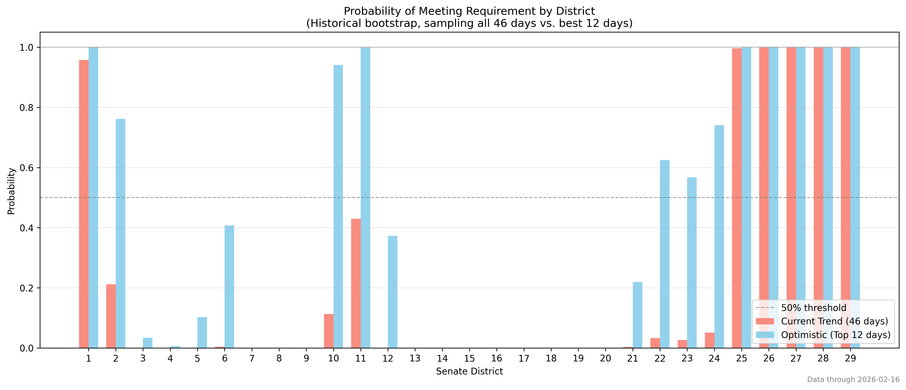
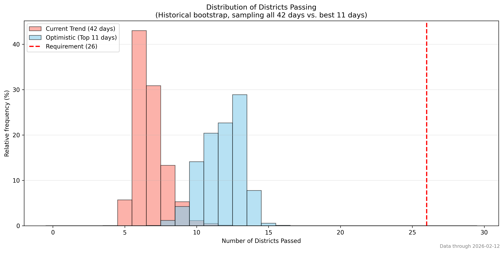
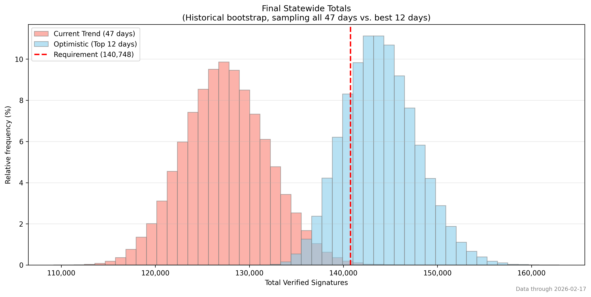
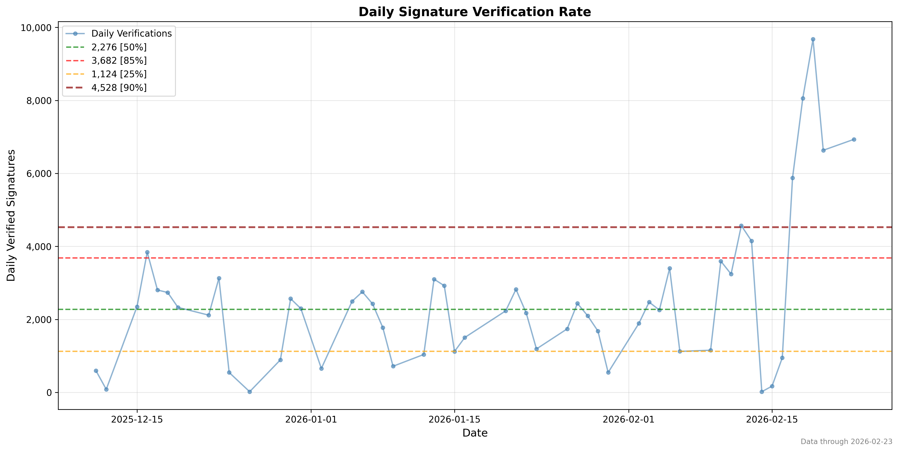
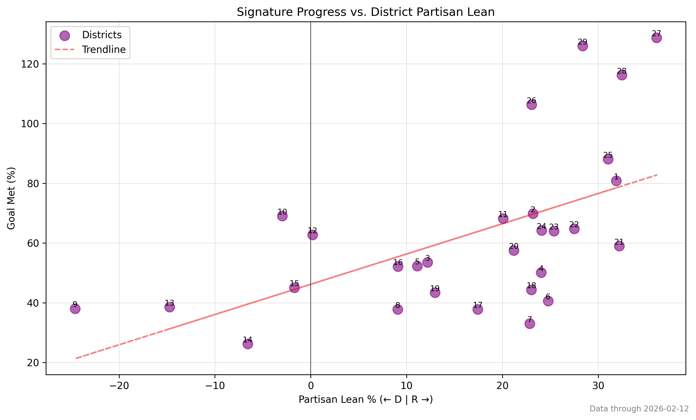
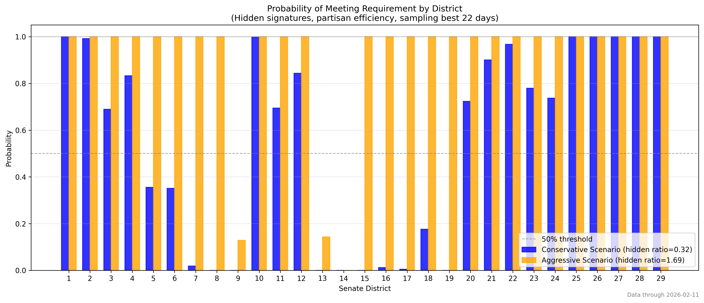
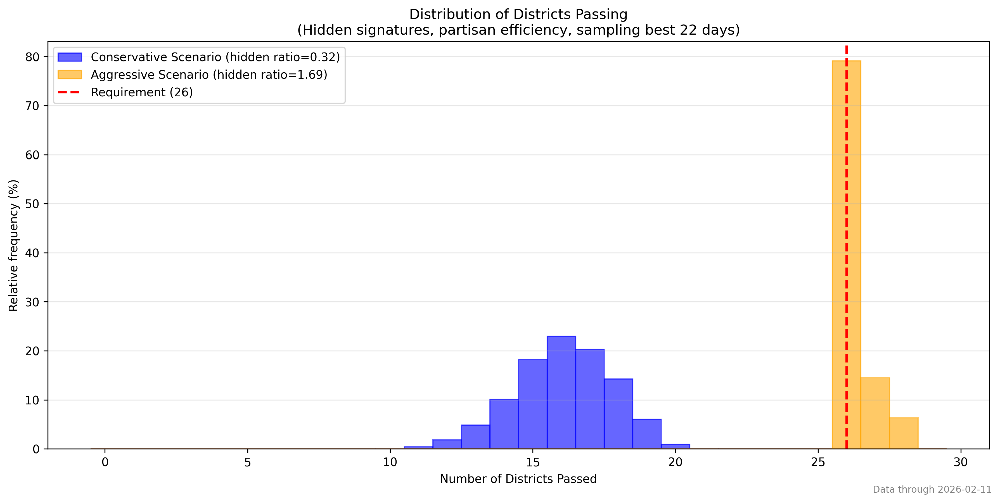
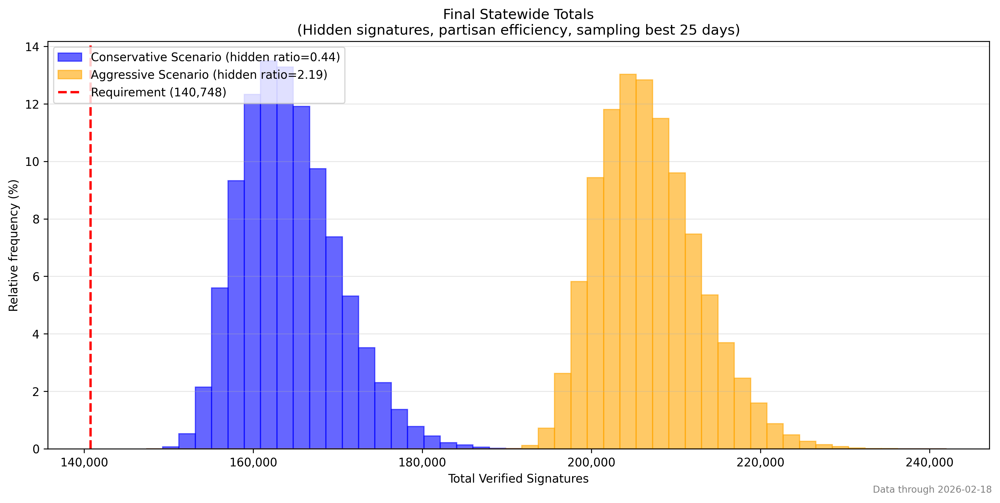

# Signature Gathering Simulations

Written and tested in Python 3.10.12.

## What these scripts do

Models possible outcomes of signature gathering initiative based on historical data. In the model created to approximate a best-case scenario for the sponsors (hidden with partisan boost), it also includes partisan voting data and some user defined assumptions about the relationship between validated signatures and unverified backlog.

## Bootstrapping methodology

- Builds daily signature gains from historical data, then repeatedly samples days (sometimes from an optimistic pool; top-performing days by a deficit-weighted score).
- Applies a partisan efficiency adjustment by comparing observed district progress to partisan-lean expectations, boosting underperforming districts.
- Models hidden signatures via a shadow ratio derived from percentile gaps in daily throughput, with a sandbagging window and an age-based release on the target date.
- Runs many trials (default 100,000) to understand what the distribution of possibilities are.

## Features

- Optimistically samples future performance from a subset of days that most improve signature counts in underperforming districts
    - Sampling from the top quantile (default 50%), based on the dot product of deficit vector and daily verification across districts
- Diagnostic correlation between partisan lean and progress. Simulated samples of underperforming districts (below the partisanship trendline) are boosted by a multiplier based on their relative underperformance.
- Hidden signature scenarios create a store of hidden (unverified) signatures for each day.
    - For example, if the hidden ratio is 1.5, this means that for every 1 signature verified on a given day, 1.5 signatures are added to a hidden store, which are included the final count. For a hidden ratio of 0.25, for every 1 signature verified, 0.25 are added to the hidden store.
    - For historical portion, a default window of the most recent 30 days accumulate hidden signatures.
    - For future portion, simulated days before the end of signature collection (2/15) also accumulate hidden signatures.
    - Two hidden signature scenarios (conservative and aggressive) are implemented by default, based on difference between a baseline and a peak throughput derived from quantile rates in the observed data.
- Plots saved to the [Hidden_w_PartisanBoost](Hidden_w_PartisanBoost) folder and 

## Install

Create and activate a virtual environment, then install dependencies:

```bash
python -m venv .venv
source .venv/bin/activate
pip install -r requirements.txt
```

## Run

Execute the simulation script from the repo root:

```bash
python hidden_w_partisan_boost.py
```

# Figures

## Bootstrap using historical performance only
Samples only from historical performance data





## Modified bootstrap Best case scenario for sponsors
Samples historical performance boosted using some assumptions as described above.





